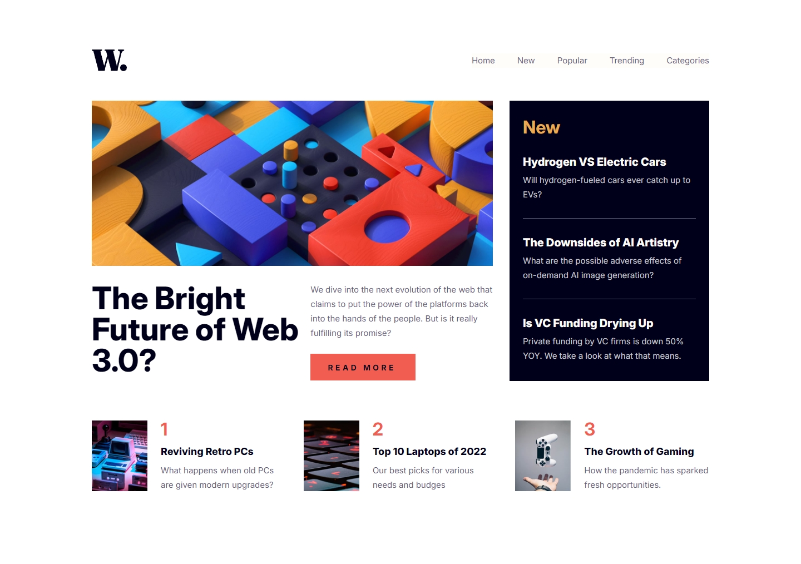

# Frontend Mentor - News homepage

This is a solution to the [News Homepage](https://www.frontendmentor.io/challenges/news-homepage-H6SWTa1MFl). Frontend Mentor challenges help you improve your coding skills by building realistic projects.

## Welcome! 👋

Thanks for checking out this front-end coding challenge.

[Frontend Mentor](https://www.frontendmentor.io) challenges help you improve your coding skills by building realistic projects.

**To do this challenge, you need a good understanding of HTML and CSS, and basic JavaScript.**

## Table of contents

- [Overview](#overview)
  - [The challenge](#the-challenge)
  - [Screenshot](#screenshot)
  - [Links](#links)
- [My process](#my-process)
  - [Built with](#built-with)
  - [Useful resources](#useful-resources)
- [Author](#author)
- [Acknowledgments](#acknowledgments)

## Overview

### The challenge

Your challenge is to build out this news website homepage and get it looking as close to the design as possible.

You can use any tools you like to help you complete the challenge. So if you've got something you'd like to practice, feel free to give it a go.

Your users should be able to:

- View the optimal layout for the interface depending on their device's screen size
- See hover and focus states for all interactive elements on the page

Want some support on the challenge? [Join our community](https://www.frontendmentor.io/community) and ask questions in the **#help** channel.

### Screenshot

### Links

- Solution URL: [GitHub repository](https://github.com/welpmoz/news-homepage).
- Live Site URL: [Live site](https://rococo-starship-d7b6bb.netlify.app/)

## My process

### Built with

- Semantic HTML5 markup
- SASS
- Accessibility
- BEM methodology
- Git & GitHub
- Mobile first approach
- Typescript
- React
- Vite
- Netlify

### Useful resources

- [Responsively](https://responsively.app/): A best browser for develop responsive webs.

## Author

- Github - [Roswell Jaime](https://github.com/welpmoz)
- Frontend Mentor - [@welpmoz](https://www.frontendmentor.io/profile/welpmoz)

## Acknowledgments

I greatly appreciate the work done by the Frontend Mentor team. Their challenges are diverse and well-suited for developers at all levels. Additionally, I'm grateful for the inclusion of Figma as a useful resource.